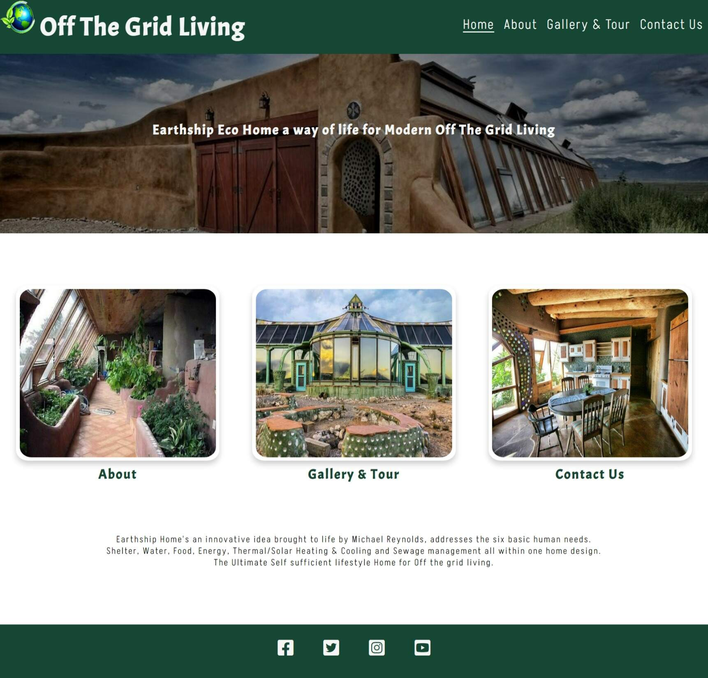
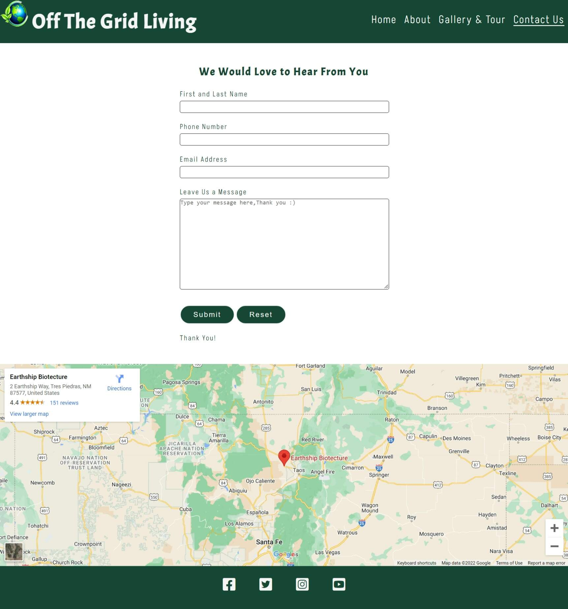

# Off The Grid Living  

Off The Grid Living is a landing site for those who are seeking to move from main stream living to off grid living. In this website you are introduced to the Earthship Eco home an innovative idea that addresses the 6 basic human needs and incorporates them right into the home environment. Making a Self-Sustainable Eco home that is both off the grid and modern.

Users of this website will be able to find information on the 6 basic human needs that are incorporated into the Earthship design along with links to further information a lovely gallery and video tur and a contact form should the user require further assistance or information.

# UX 

I wanted to aim for a visually appealing website that also imparted information to the user on the Earthship Eco Home as an Off The Grid Living option.
Keeping the site clean and sleek whilst engaging the user with the website whilst adding a touch of fun.
On the home page I went for an animated introduction picture on the home that zooms in in order to draw the eye to the home's look and feel. Under this I added 3 images that link to the other 3 pages of the site making it fun and visually appealing to keep the user engaged. Under these 3 images I added a short introduction in order to entice and add value to the information to follow.
The about page starts with a brief history acquired from Wikipedia and referenced within the history paragraph with a link to this site, also here I have added at the end of the history paragraph for more information 2 external links to the original Earthship website and again to Wikipedia. The about page information is set up in a row column format with information to one side and an image to another so the user can choose to glance at the images or read the information either way the information is visible and understandable the hope is the images entice the user to read the information.
The Gallery and tour section is set up with an iframe YouTube video tour about the Earthship eco home and is only playable if the user decides to play it under this there are gallery images of the Earthship home both external and internal images to show the user what the home could and does look like.
The Contact Us page is set up very clearly and minimalistic so as to not distract from the main point of getting contact information making to clean and easy to use under this is a Google Earth map that shows the location of the original Earthship location should the user be inclined to find them as an additional pull to the user to make contact.
Adjustments have been made from the original wireframes made for the project this was to add value and a better flow to the webpages made.

## Balsamiq Wireframes

 

# Features
* Navigation 
    
    + Navigation Bar to the right of screen showing Home, About, Gallery and Tour and Contact us pages
    + Navigation under the main Home page image are 3 link images which link to the About, Gallery and Tour and Contact Us pages respectively.
    + In the footer are the 4 social media links.
    + All navigation and social media links are clear against the header and footer back ground and make the website easy for the user to navigate.
    + In the About page internal links are provided in a visible and easy to use manner that correlate to the information which they navigate to.
    + In the Gallery and Tour, a YouTube video is provided for the user which will only play if the user should choose.
    + In the contact us page a contact for clearly marked and easy to use is provided and under this is an interactive google map which the user can click on to an external larger map. 

# Home Page   

* The Header and footer 
    + Background colour is in the chosen theme of colour of green with smoke white font for visibility.
    + The Header shows the Website name with a logo of the Earth in front of it to the right is the navigation menu bar clearly showing the pages of the website in an easy to use and understand manner.
    + The Footer has the social media links to the middle of the footer and are clearly marked with known icons for the chosen social media.

 * Body
    + The Body of the home page gives an introduction landing page that engages the user and with clear information as to what the website is about.
    + 3 Link images below the main image supply a visually appealing means of navigation and further engage the user in a fun but user-friendly means of navigating the site.
    + A brief paragraph further engages the user with a snippet of information to entice the user to proceed further into the website. 

# About page

* The About section
    + The about section has internal links at the top of the page visible and clearly labelled to correlate to the information supplied within the about page.  
    + The About page provides important information and images about the core design and principles of the Earthship eco home and what it provides for the Off the Grid living and how it provides it.

 

# Gallery & Tour Page

* Gallery & Tour Section
    + Here the user is supplied with an informative and fun YouTube video relevant to the Earth Ship eco home
    + Under the YouTube video the user is provided with visuals a gallery of the Earthship Eco home both internal and external images are provided.

# Contact Us

* Contact Us section
    + Here an Easy to understand and fill in Contact form is provided.
    + Under the contact form a google map is provided showing the location of the Earthship Biotecture the map is able to open up on a larger external page should the user wish to see the location.

# Technologies / Support Used

* Below is a list of Technologies / Support I have used to build my site.
 
    + HTML is used to provide the structure and content of the website.
    + CSS is used via link to the HTML to provided style the pages.
    + Code Institute lessons and the Love Running played a big role in assisting with my project.
    + Love Running provided the main structure and information for my Header and footer as well as the animation information and inspiration for the Home page first image and the image gallery in the Gallery and Tour section. In the contact us section from loved running contact form I have use the contact us form landing site in order to have my contact form land somewhere.
    + Stack Overflow provided a lot of understanding and additional html code that I had to look up in order to do the image links on the home page and understand the flex and row and column for my webpage as well as the understanding of iframes. 
    + Git used to code within and provided backups of all my code.
    + GitHub for my repository and external project deployment.
    + Google Fonts for my font choose for the project.
    + Font Awesome for my social media font icons.
    + Freeiconspng for the Earth Icon used in front of the website Name in the Headers.

# Testing

  * Testing During development of the pages was done through the project to see how the project looked and felt

    + Testing done via git preview.   
    + Testing of the media queries was carried out via dev tools on Microsoft Edge.
    + HTML was tested through W3C Html validator
    + CSS was tested through W3C Css Validator 
    + HTML was run through an online formatter, FreeFormatter.com
    + Responsive design media queries tested through Am I Responsive
    + Lighthouse used to test webpage for Performance,Accessibility,Best Practice and SEO
    + Deployed project was tested in my default browser Microsoft Edge as wells as Google Chrome and Firefox.

# Bugs

Debugging occurred during the process of development and testing as the website was built as testing was done constantly as errors "bugs" were detected during testing I would use dev tools to see and test what would solve the particular error that occurred and or do searches in the Technologies and support mentioned above and fix the errors as they occurred.

# Validator Testing

* Test Validators
    + HTML - W3C Html Validator - No errors returned when pass through
    + CSS - W3C CSS Validator - No errors returned when pass through
    + RESPONSIVENESS - Am I Responsive for different divices media queries.
    + LIGHTHOUSE - Website tested for Performance, Accessibility, Best Practice and SEO as seen below.

# Deployment of Project

* Deployment was made possible by GitHub
    + Initiated a repository in git
    + Deployment via git repository to the GitHub page and linking the main root to this and thus been hosted by GitHub.

# Credits

   * Code Institute without who I would have had no base to begin a project
   * GitHub for my workspace and saving all my work as well as my deployed project
   * Reuben Ferrante my mentor without all his great guidance I would be lost and who also suggested the smooth-scroll for my internal links. A Huge Thanks.
   * The Slack community - for someone always been there no matter the time and with advice or direction.
   * Balsamiq used to build the wireframes for my project.
   * Earthship Biotecture for the inspiration and information for my project
   * Wikipedia Earthship section for information for my project
   * W3C Validators both HTML and CSS to keep a check on my code.
   * I am Responsive for a fantastic spot to see a visual of responsiveness.

* Copied Code / Code assistance  
As stated in Technologies / Support Used I used and sort out help and code from numerous sources as well as fonts and icons. However, I did exclusively copy code from Love running for the animation on the home page and gallery. Stack over flow played a huge roll in my overall development especially the card link images where code was copied for most of the elements used in these.

# Imagery for Project

 * Images obtained via bing image search with the free to use, modify and distribute license requirement on.

 

 * Video Obtained from YouTube.

 * Map obtained from Google Maps.

